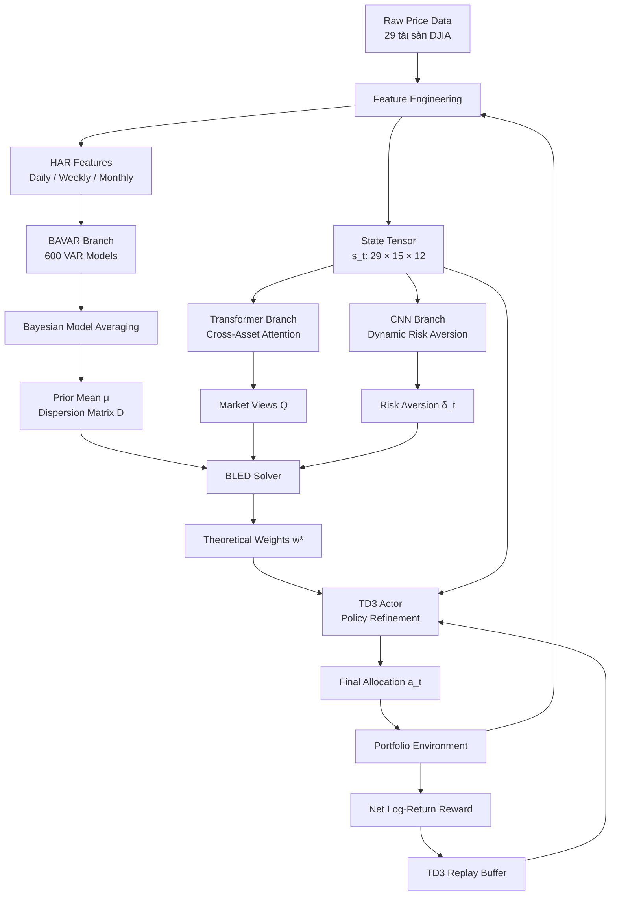
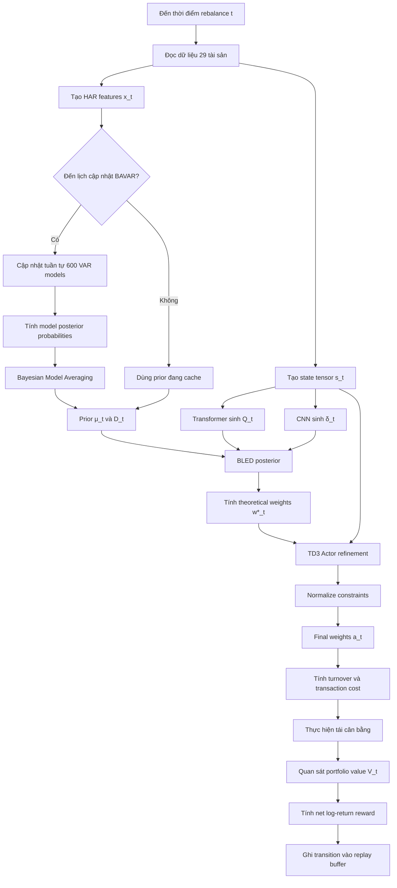
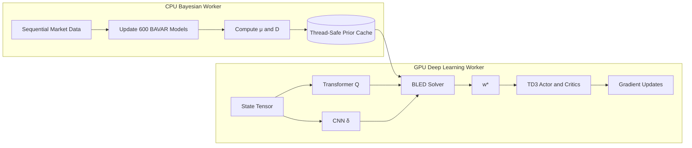
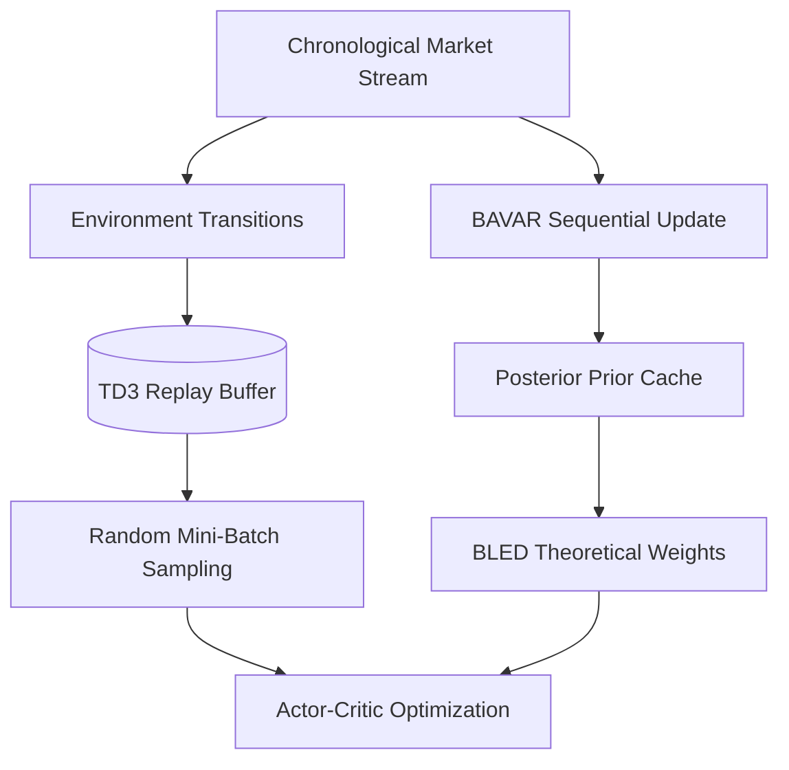

# BAVAR-BLED

## Hệ thống tối ưu hóa danh mục thích ứng trạng thái thị trường và rủi ro đuôi dày

> **BAVAR-BLED** là một kiến trúc lai kết hợp Bayesian Model Averaging, Vector Autoregression, Black-Litterman dưới phân phối Elip, Transformer, CNN và TD3 để xây dựng chiến lược phân bổ danh mục động, có khả năng thích ứng theo trạng thái thị trường và kiểm soát rủi ro đuôi dày.

---

## Mục lục

1. [Đặt vấn đề và ý tưởng cốt lõi](#1-đặt-vấn-đề-và-ý-tưởng-cốt-lõi)
2. [Tổng quan kiến trúc hệ thống](#2-tổng-quan-kiến-trúc-hệ-thống)
3. [Dữ liệu đầu vào và biểu diễn trạng thái](#3-dữ-liệu-đầu-vào-và-biểu-diễn-trạng-thái)
4. [Chi tiết toán học của từng thành phần](#4-chi-tiết-toán-học-của-từng-thành-phần)
5. [Định dạng bài toán học tăng cường](#5-định-dạng-bài-toán-học-tăng-cường)
6. [Quy trình vận hành chiến lược](#6-quy-trình-vận-hành-chiến-lược)
7. [Tối ưu hóa hạ tầng tính toán](#7-tối-ưu-hóa-hạ-tầng-tính-toán)
8. [Đánh giá kết quả kiểm thử](#8-đánh-giá-kết-quả-kiểm-thử)
9. [Diễn giải định lượng](#9-diễn-giải-định-lượng)

---

# 1. Đặt vấn đề và ý tưởng cốt lõi

## 1.1. Research gap

Trong quản trị danh mục hiện đại, việc ứng dụng **Học tăng cường sâu** (*Deep Reinforcement Learning — DRL*) đem lại khả năng học trực tiếp một chính sách phân bổ động từ dữ liệu thị trường.

Tuy nhiên, các kiến trúc DRL truyền thống thường gặp hai giới hạn quan trọng.

### 1.1.1. Đánh giá thấp rủi ro đuôi dày

Phần lớn mô hình định lượng cổ điển giả định lợi suất tài sản tuân theo phân phối chuẩn Gaussian. Trong thực tế, lợi suất tài chính thường có:

- Độ nhọn cao hơn phân phối chuẩn;
- Xác suất xuất hiện biến động cực đoan lớn hơn kỳ vọng;
- Hiện tượng volatility clustering;
- Các cú sốc làm tương quan giữa tài sản tăng mạnh trong khủng hoảng.

Do đó, mô hình Gaussian có thể đánh giá thấp xác suất thua lỗ cực đoan và dẫn tới mức sụt giảm vốn lớn khi thị trường chuyển sang trạng thái căng thẳng.

### 1.1.2. Mù trạng thái thị trường

Một tác tử DRL có thể xử lý toàn bộ lịch sử như một phân phối đồng nhất mà không phân biệt mức độ phù hợp của từng giai đoạn đối với trạng thái hiện tại.

Điều này làm giảm khả năng thích ứng khi thị trường chuyển trạng thái, chẳng hạn:

- Từ xu hướng tăng sang xu hướng giảm;
- Từ biến động thấp sang biến động cao;
- Từ trạng thái phân tán tương quan sang trạng thái tương quan đồng loạt;
- Từ momentum sang mean reversion.

## 1.2. Giải pháp BAVAR-BLED

BAVAR-BLED giải quyết đồng thời hai vấn đề trên bằng một kiến trúc lai gồm ba tầng chính.

| Thành phần | Vai trò |
|---|---|
| **BAVAR** | Duy trì quần thể 600 mô hình VAR, cập nhật xác suất Bayes để ước lượng kỳ vọng lợi suất $\mu$ và ma trận phân tán $D$ theo trạng thái thị trường hiện tại. |
| **BLED** | Mở rộng Black-Litterman trong họ phân phối Elip, sử dụng Student's $t$ để mô hình hóa rủi ro đuôi dày. |
| **TD3** | Không sinh trọng số hoàn toàn từ đầu; tác tử tinh chỉnh trọng số lý thuyết $w^*$ của BLED thành hành động phân bổ cuối cùng dưới ma sát thị trường. |

Các mạng học sâu hỗ trợ thêm hai tín hiệu:

- **Transformer** sinh quan điểm thị trường $Q$;
- **CNN** ước lượng hệ số e ngại rủi ro động $\delta_t$.

---

# 2. Tổng quan kiến trúc hệ thống

## 2.1. Luồng xử lý end-to-end



## 2.2. Logic của từng nhánh

### Nhánh 1 — BAVAR

1. Trích xuất HAR features từ chuỗi lợi suất;
2. Cập nhật tuần tự 600 mô hình VAR;
3. Tính predictive likelihood của từng mô hình;
4. Cập nhật xác suất hậu nghiệm của mô hình;
5. Hợp nhất dự báo bằng Bayesian Model Averaging;
6. Xuất ra $\mu$ và $D$.

### Nhánh 2 — Transformer

1. Nhận tensor trạng thái đa tài sản;
2. Học quan hệ chéo giữa các tài sản qua attention;
3. Không sử dụng positional encoding;
4. Sinh vector quan điểm lợi suất $Q$.

### Nhánh 3 — CNN

1. Quét tensor giá, khối lượng và chỉ báo kỹ thuật;
2. Trích xuất pattern cục bộ;
3. Đánh giá trạng thái rủi ro hiện tại;
4. Sinh hệ số e ngại rủi ro động $\delta_t$.

### Tầng hợp nhất — BLED

BLED kết hợp:

- Prior $(\mu, D)$ từ BAVAR;
- Views $Q$ từ Transformer;
- Risk aversion $\delta_t$ từ CNN;

để tính trọng số danh mục lý thuyết $w^*$.

### Tầng tinh chỉnh — TD3

TD3 nhận:

- Trạng thái thị trường $s_t$;
- Trọng số lý thuyết $w^*$;
- Trạng thái danh mục hiện tại;

và sinh hành động cuối cùng $a_t$ phù hợp hơn với chi phí giao dịch và động lực môi trường.

---

# 3. Dữ liệu đầu vào và biểu diễn trạng thái

## 3.1. Universe tài sản

Mô hình sử dụng dữ liệu của **29 cổ phiếu thuộc rổ DJIA**, loại trừ NVDA.

## 3.2. Tensor trạng thái

Tại thời điểm $t$, trạng thái của môi trường được biểu diễn dưới dạng:

$$
s_t \in \mathbb{R}^{29 \times 15 \times 12}
$$

Trong đó:

- **29**: số tài sản;
- **15**: số ngày trong cửa sổ nhìn lại;
- **12**: số đặc trưng thị trường và kỹ thuật.

Nhóm 12 đặc trưng bao gồm:

- Giá;
- Khối lượng;
- 5 đường EMA;
- MACD;
- RSI;
- Bollinger Bands;
- Lợi suất log quá khứ.

## 3.3. Hai biểu diễn dữ liệu song song

Hệ thống tạo hai dạng biểu diễn từ cùng dữ liệu thô:

| Biểu diễn | Thành phần sử dụng | Mục đích |
|---|---|---|
| **State tensor** $29 \times 15 \times 12$ | Transformer, CNN, TD3 | Học pattern phi tuyến và tương tác đa tài sản. |
| **HAR features** | BAVAR | Nắm bắt động lượng ngắn hạn và mean reversion trung hạn bằng mô hình thống kê Bayes. |

---

# 4. Chi tiết toán học của từng thành phần

## 4.1. Nhánh BAVAR và HAR features

### 4.1.1. Trích xuất đặc trưng HAR

Để nắm bắt nhiều quy mô thời gian, vector đặc trưng tại thời điểm $t-1$ được xây dựng như sau:

$$
x_{t-1}
=
\begin{bmatrix}
1 \\
\bar r_{t-1}^{(d)} \\
\bar r_{t-1}^{(w)} \\
\bar r_{t-1}^{(m)}
\end{bmatrix}
\in \mathbb{R}^{4 \times 1}
\tag{1}
$$

Trong đó:

$$
\bar r_{t-1}^{(d)} = r_{t-1}
$$

$$
\bar r_{t-1}^{(w)}
=
\frac{1}{5}\sum_{j=1}^{5}r_{t-j}
$$

$$
\bar r_{t-1}^{(m)}
=
\frac{1}{22}\sum_{j=1}^{22}r_{t-j}
$$

Ý nghĩa:

- $\bar r_{t-1}^{(d)}$: lợi suất của ngày giao dịch gần nhất;
- $\bar r_{t-1}^{(w)}$: lợi suất trung bình 5 ngày;
- $\bar r_{t-1}^{(m)}$: lợi suất trung bình 22 ngày.

> Tham chiếu gốc: `[cite: 86]`.

### 4.1.2. Cấu trúc mô hình VAR thành phần

Hệ thống duy trì một ensemble gồm:

$$
M = 600
$$

mô hình VAR.

Lợi suất của $n=29$ tài sản được mô hình hóa bởi:

$$
r_t = B_t x_{t-1} + \varepsilon_t,
\qquad
\varepsilon_t \sim \mathcal{N}(0, \Sigma_t)
\tag{2}
$$

với:

$$
B_t \in \mathbb{R}^{n \times k},
\qquad
n=29,
\qquad
k=4
$$

Mỗi mô hình $m$ duy trì một bộ tham số hậu nghiệm riêng:

$$
\left(
\bar B_{m,t},
\Phi_{m,t},
\Lambda_{m,t},
\nu_{m,t}
\right)
$$

Các mô hình sử dụng cấu hình siêu tham số khác nhau để tạo tính đa dạng cho ensemble.

> Tham chiếu gốc: `[cite: 92, 94]`.

## 4.2. Cập nhật đệ quy Bayes

Tại mỗi bước thời gian $t$, sau khi quan sát lợi suất thực tế $r_t$, từng mô hình được cập nhật tuần tự bằng cấu trúc conjugate Gaussian–Inverse-Wishart.

### 4.2.1. Sai số dự báo

$$
e_{m,t}
=
r_t - \bar B_{m,t-1}x_{t-1}
\tag{3}
$$

### 4.2.2. Cập nhật ma trận tích lũy sai số

$$
\Lambda_{m,t}
=
\Lambda_{m,t-1}
+
\frac{
 e_{m,t}e_{m,t}^{\top}
}{
 1+x_{t-1}^{\top}\Phi_{m,t-1}x_{t-1}
}
\tag{4}
$$

### 4.2.3. Cập nhật bậc tự do

$$
\nu_{m,t}
=
\nu_{m,t-1}+1
\tag{5}
$$

### 4.2.4. Cập nhật ma trận độ chính xác hệ số

$$
\Phi_{m,t}
=
\left(
\Phi_{m,t-1}^{-1}
+x_{t-1}x_{t-1}^{\top}
\right)^{-1}
\tag{6}
$$

### 4.2.5. Cập nhật hệ số hậu nghiệm

Với quy ước $\bar B_{m,t}\in\mathbb{R}^{n\times k}$, công thức được viết nhất quán về kích thước như sau:

$$
\bar B_{m,t}
=
\left[
\bar B_{m,t-1}\Phi_{m,t-1}^{-1}
+r_t x_{t-1}^{\top}
\right]
\Phi_{m,t}
\tag{7}
$$

> Tham chiếu gốc: `[cite: 96, 97, 98]`.

## 4.3. Trọng số mô hình và Bayesian Model Averaging

### 4.3.1. Cập nhật xác suất mô hình

Trọng số xác suất $P(m\mid F_t)$ phản ánh mức độ phù hợp của mô hình $m$ với trạng thái thị trường hiện tại:

$$
P(m\mid F_t)
=
\frac{
P(r_t\mid m,F_{t-1})P(m\mid F_{t-1})
}{
\sum_{m'}P(r_t\mid m',F_{t-1})P(m'\mid F_{t-1})
}
\tag{8}
$$

Trong đó:

- $P(r_t\mid m,F_{t-1})$: predictive likelihood của mô hình $m$;
- $P(m\mid F_{t-1})$: xác suất mô hình trước khi nhận quan sát mới;
- $P(m\mid F_t)$: xác suất hậu nghiệm sau khi nhận $r_t$.

> Tham chiếu gốc: `[cite: 108]`.

### 4.3.2. Dự báo cục bộ của từng mô hình

$$
\mu_m
=
\bar B_m x_{t-1}
\tag{9}
$$

$$
\Sigma_m
=
\frac{\Lambda_m}{\nu_m-n-1}
\tag{10}
$$

### 4.3.3. Hợp nhất kỳ vọng lợi suất

$$
\mu
=
\sum_m P(m\mid F_t)\mu_m
\tag{11}
$$

### 4.3.4. Hợp nhất ma trận phân tán

$$
D
=
\sum_m P(m\mid F_t)
\left[
\Sigma_m+\mu_m\mu_m^{\top}
\right]
-
\mu\mu^{\top}
\tag{12}
$$

Công thức trên giữ lại cả:

- Rủi ro nội tại trong từng mô hình qua $\Sigma_m$;
- Độ bất định giữa các dự báo mô hình qua $\mu_m\mu_m^\top$.

> Tham chiếu gốc: `[cite: 140]`.

---

## 4.4. Transformer — sinh quan điểm thị trường

Nhánh Transformer sử dụng:

- **4 encoder layers**;
- **2 attention heads**;
- Không sử dụng positional encoding;
- Đầu ra là vector views:

$$
Q_t \in \mathbb{R}^{n}
$$

với $n=29$.

### Insight thiết kế

Cửa sổ quan sát có độ dài ngắn:

$$
w=15
$$

Do đó, kiến trúc loại bỏ positional encoding để ưu tiên học cấu trúc phụ thuộc chéo giữa tài sản thay vì nhấn mạnh vị trí tuyệt đối của từng ngày trong chuỗi.

Có thể biểu diễn nhánh này dưới dạng:

$$
Q_t
=
f_{\text{Transformer}}(s_t)
\tag{13}
$$

Trong đó, $Q_t$ là quan điểm lợi suất mà mô hình học sâu đưa vào Black-Litterman.

---

## 4.5. CNN — ước lượng hệ số e ngại rủi ro động

CNN 2D quét qua tensor trạng thái để trích xuất pattern từ:

- Giá;
- Khối lượng;
- Momentum;
- Volatility;
- Quan hệ cục bộ giữa tài sản, thời gian và đặc trưng.

Đầu ra là một scalar:

$$
\delta_t
=
f_{\text{CNN}}(s_t)
\tag{14}
$$

với:

$$
\delta_t > 0
$$

Ý nghĩa:

- Khi biến động thị trường cao, $\delta_t$ tăng và mô hình thu hẹp vị thế rủi ro;
- Khi thị trường ổn định, $\delta_t$ giảm và mô hình chấp nhận mức exposure lớn hơn để tìm kiếm alpha.

---

## 4.6. BLED — Black-Litterman dưới phân phối Elip

### 4.6.1. Phân phối lợi suất đuôi dày

Thay vì giả định Gaussian, BLED mô hình hóa lợi suất bằng phân phối Student's $t$ thuộc họ phân phối Elip:

$$
f_X(x;\mu,D)
=
|D|^{-1/2}
g_n\left(
(x-\mu)^{\top}D^{-1}(x-\mu)
\right)
\tag{15}
$$

Trong đó:

- $\mu$: vector kỳ vọng lợi suất từ BAVAR;
- $D$: ma trận phân tán;
- $g_n(\cdot)$: hàm sinh mật độ Elip.

> Tham chiếu gốc: `[cite: 152]`.

### 4.6.2. Kết hợp prior và views

BLED kết hợp:

- Prior $(\mu,D)$ từ BAVAR;
- Views $Q$ từ Transformer;
- Ma trận ánh xạ views $P$;
- Ma trận bất định $\Omega$.

Kỳ vọng hậu nghiệm được tính bởi:

$$
\mu_{BL}
=
\mu
+
\left[
(\tau D)^{-1}
+P^{\top}\Omega^{-1}P
\right]^{-1}
P^{\top}\Omega^{-1}(Q-P\mu)
\tag{16}
$$

Ma trận phân tán hậu nghiệm:

$$
D_{BL}
=
D
-DP^{\top}
\left(
\Omega+PDP^{\top}
\right)^{-1}
PD
\tag{17}
$$

Các tham số được sử dụng:

$$
\tau=0.039
$$

$$
P=I_n
$$

$$
\sigma_{\Omega}^{2}=0.052
$$

Trong cấu hình này, $P$ là ma trận đơn vị nên mỗi phần tử của $Q$ biểu diễn một view trực tiếp trên một tài sản.

> Tham chiếu gốc: `[cite: 153, 154]`.

### 4.6.3. Trọng số lý thuyết

Trọng số tối ưu lý thuyết được tính trực tiếp:

$$
w_t^*
=
\frac{1}{\delta_t}
D_{BL,t}^{-1}\mu_{BL,t}
\tag{18}
$$

Ý nghĩa:

- $\mu_{BL,t}$ càng lớn thì tài sản càng được ưu tiên;
- Rủi ro và tương quan trong $D_{BL,t}$ làm giảm hoặc phân tán allocation;
- $\delta_t$ càng lớn thì tổng mức chấp nhận rủi ro càng thấp.

> Tham chiếu gốc: `[cite: 165, 166, 167]`.

---

# 5. Định dạng bài toán học tăng cường

Bài toán được mô hình hóa dưới dạng Markov Decision Process:

$$
\mathcal{M}
=
(\mathcal{S},\mathcal{A},\mathcal{P},\mathcal{R},\gamma)
$$

## 5.1. State space

$$
s_t \in \mathbb{R}^{29\times15\times12}
$$

State chứa thông tin của 29 tài sản trong 15 ngày gần nhất với 12 đặc trưng.

Ngoài tensor thị trường, actor có thể nhận thêm trọng số lý thuyết $w_t^*$ làm anchor cho quá trình refinement.

## 5.2. Action space

Action là vector liên tục gồm 30 phần tử:

$$
a_t
=
\begin{bmatrix}
w_{1,t},\ldots,w_{29,t},w_{\text{cash},t}
\end{bmatrix}^{\top}
\in\mathbb{R}^{30}
$$

Chiến lược cho phép bán khống và sử dụng chuẩn hóa gross exposure:

$$
\sum_{i=1}^{n+1}|w_{i,t}|=1,
\qquad
w_{i,t}\in[-1,1]
\tag{19}
$$

> Tham chiếu gốc: `[cite: 78]`.

## 5.3. Portfolio return

Lợi suất danh mục trước chi phí được biểu diễn bởi:

$$
r_{p,t}
=
w_{t-1}^{\top}r_t
\tag{20}
$$

## 5.4. Chi phí giao dịch

Chi phí turnover tại thời điểm $t$:

$$
\mu_t
=
c\sum_i|w_{i,t}-w_{i,t-1}|
\tag{21}
$$

với:

$$
c=0.0025
$$

## 5.5. Cập nhật giá trị danh mục

$$
V_t
=
V_{t-1}(1+r_{p,t})(1-\mu_t)
\tag{22}
$$

## 5.6. Reward function

Reward là log-return sau chi phí:

$$
R_t
=
\log(V_t+\varepsilon)
-
\log(V_{t-1}+\varepsilon)
\tag{23}
$$

Trong đó $\varepsilon$ là số dương nhỏ giúp đảm bảo ổn định số học.

> Tham chiếu gốc: `[cite: 80, 82]`.

## 5.7. Vai trò của TD3

TD3 không thay thế toàn bộ tầng tối ưu hóa định lượng. Actor thực hiện:

$$
a_t
=
\pi_{\theta}(s_t,w_t^*)
\tag{24}
$$

Trong đó:

- $w_t^*$ là trọng số anchor từ BLED;
- $a_t$ là trọng số cuối cùng;
- $\pi_{\theta}$ là policy của actor.

Cách thiết kế này giúp giảm không gian tìm kiếm so với việc yêu cầu DRL học allocation hoàn toàn từ đầu.

---

# 6. Quy trình vận hành chiến lược

## 6.1. Chu kỳ ra quyết định



## 6.2. Thuật toán chiến lược

Tại mỗi thời điểm tái cân bằng:

1. Thu thập cửa sổ dữ liệu 15 ngày cho 29 tài sản;
2. Tạo tensor $s_t$ và HAR vector $x_{t-1}$;
3. Nếu đến chu kỳ cập nhật BAVAR, cập nhật tuần tự toàn bộ ensemble;
4. Tính xác suất hậu nghiệm của 600 mô hình;
5. Tổng hợp $\mu_t$ và $D_t$ bằng BMA;
6. Transformer sinh views $Q_t$;
7. CNN sinh risk aversion $\delta_t$;
8. BLED tính $\mu_{BL,t}$, $D_{BL,t}$ và $w_t^*$;
9. TD3 tinh chỉnh $w_t^*$ thành hành động $a_t$;
10. Chuẩn hóa action theo giới hạn trọng số và gross exposure;
11. Tính turnover và chi phí giao dịch;
12. Tái cân bằng danh mục;
13. Tính reward sau chi phí;
14. Ghi transition vào replay buffer để huấn luyện TD3.

## 6.3. Pseudocode

```text
Initialize BAVAR ensemble with M = 600 models
Initialize Transformer, CNN, TD3 Actor and Critics
Initialize TD3 replay buffer
Initialize portfolio weights and value

for each trading step t:
    state_tensor = build_state_tensor(t, shape=(29, 15, 12))
    har_features = build_har_features(t)

    if is_bavar_update_step(t):
        for model m in 1..600:
            update_recursive_bayesian_statistics(model, har_features, realized_return)
            update_predictive_likelihood(model)
            update_model_posterior_probability(model)

        mu_prior, D_prior = bayesian_model_average(models)
        cache(mu_prior, D_prior)
    else:
        mu_prior, D_prior = read_cached_prior()

    Q = transformer(state_tensor)
    delta = cnn(state_tensor)

    mu_bl, D_bl = bled_posterior(mu_prior, D_prior, Q)
    w_star = inverse(D_bl) @ mu_bl / delta

    action = td3_actor(state_tensor, w_star)
    action = normalize_and_project_constraints(action)

    turnover_cost = c * sum(abs(action - previous_weights))
    portfolio_value = environment.step(action, turnover_cost)
    reward = log(portfolio_value + epsilon) - log(previous_value + epsilon)

    replay_buffer.add(state, w_star, action, reward, next_state)
    train_td3_from_random_minibatch(replay_buffer)
```

---

# 7. Tối ưu hóa hạ tầng tính toán

## 7.1. Điểm nghẽn tính toán

Khối BAVAR phải cập nhật 600 mô hình VAR tại mỗi bước thời gian. Nếu thực hiện đồng bộ trong toàn bộ episode, thời gian huấn luyện có thể đạt khoảng:

$$
2600\ \text{giây/episode}
$$

Đây là bottleneck chính vì:

- BAVAR cần xử lý tuần tự;
- TD3 cần tối ưu gradient nhiều lần;
- GPU có thể phải chờ CPU hoàn thành Bayesian update;
- 600 mô hình tạo ra nhiều phép toán ma trận lặp lại.

## 7.2. Asynchronous Hybrid Wrapper

Giải pháp là tách BAVAR khỏi đường huấn luyện gradient chính.



Cơ chế vận hành:

1. BAVAR chạy trong một computational thread độc lập;
2. Kết quả $\mu$ và $D$ được ghi vào cache dùng chung;
3. Actor đọc prior gần nhất từ cache;
4. GPU không phải chờ toàn bộ ensemble cập nhật tại mỗi gradient step;
5. BAVAR chỉ cập nhật **12 lần mỗi năm**, tương đương khoảng 21 ngày giao dịch một lần.

Nhờ vậy, thời gian huấn luyện giảm từ khoảng:

$$
2600\ \text{giây/episode}
$$

xuống:

$$
750\ \text{giây/episode}
$$

mà vẫn giữ được cơ chế thích ứng trạng thái theo chu kỳ.

## 7.3. Decoupled Replay Buffer

BAVAR và TD3 yêu cầu hai cơ chế lấy mẫu hoàn toàn khác nhau.

### BAVAR

Phải xử lý dữ liệu theo thứ tự thời gian:

$$
(r_1,r_2,\ldots,r_T)
$$

Lý do là posterior tại thời điểm $t$ phụ thuộc trực tiếp vào posterior tại thời điểm $t-1$.

### TD3

Huấn luyện bằng mini-batch lấy mẫu ngẫu nhiên:

$$
\mathcal{B}
\sim
\operatorname{Uniform}(\mathcal{D})
$$

Trong đó $\mathcal{D}$ là replay buffer.

Random sampling giúp:

- Giảm tự tương quan giữa mẫu;
- Ổn định critic training;
- Tái sử dụng experience;
- Cải thiện sample efficiency.

### Kiến trúc tách biệt



Việc tách biệt này duy trì:

- Tính toàn vẹn thời gian của Bayes update;
- Yêu cầu randomization của off-policy RL;
- Khả năng chống data leakage;
- Khả năng hạn chế overfitting do học tuần tự trực tiếp trên các mẫu liền kề.

## 7.4. Chi phí huấn luyện

Pha huấn luyện hoàn chỉnh cần khoảng:

$$
80\ \text{giờ}
$$

trên cụm phần cứng GPU hiệu năng cao, với Bayesian worker chạy song song ở CPU.

---

# 8. Đánh giá kết quả kiểm thử

## 8.1. Thiết lập đánh giá

Sau khi hoàn thành pha huấn luyện, mô hình được đánh giá trên tập dữ liệu **out-of-sample**.

Các metric chính tập trung vào:

- Lợi suất tích lũy;
- Lợi suất điều chỉnh theo rủi ro;
- Rủi ro downside;
- Drawdown;
- Mức biến động thường niên.

## 8.2. Kết quả mục tiêu

| Chỉ số | Kết quả BAVAR-BLED | Diễn giải định lượng |
|---|---:|---|
| **Sharpe Ratio** | **1.72** | Lợi suất vượt trội trên một đơn vị biến động tổng thể. |
| **Sortino Ratio** | **2.70** | Hiệu quả cao khi chỉ phạt downside volatility. |
| **Accumulated Return** | **57.26%** | Lợi suất gộp tích lũy cao trên tập kiểm thử. |
| **Maximum Drawdown** | **-8.85%** | Mức sụt giảm cực đại được duy trì ở một chữ số. |
| **Annualized Volatility** | **12.64%** | Biến động thường niên ở mức hợp lý trong điều kiện fully invested. |

## 8.3. Công thức các metric chính

### Sharpe Ratio

$$
\operatorname{Sharpe}
=
\frac{\mathbb{E}[R_p-R_f]}{\sigma(R_p-R_f)}
\sqrt{N}
$$

### Sortino Ratio

$$
\operatorname{Sortino}
=
\frac{\mathbb{E}[R_p-R_f]}{\sigma_{\text{downside}}}
\sqrt{N}
$$

### Maximum Drawdown

$$
\operatorname{MDD}
=
\min_t
\left(
\frac{V_t-\max_{u\le t}V_u}{\max_{u\le t}V_u}
\right)
$$

### Annualized Volatility

$$
\sigma_{\text{ann}}
=
\sigma_{\text{period}}
\sqrt{N}
$$

---

# 9. Diễn giải định lượng

## 9.1. Vì sao Sortino cao hơn Sharpe đáng kể?

Kết quả:

$$
\operatorname{Sharpe}=1.72
$$

và:

$$
\operatorname{Sortino}=2.70
$$

cho thấy upside volatility đóng góp đáng kể vào biến động tổng thể, trong khi downside volatility được kiểm soát tốt hơn.

Điều này phù hợp với thiết kế của mô hình:

- Student's $t$ xử lý tail risk;
- BAVAR điều chỉnh prior theo trạng thái;
- CNN tăng risk aversion khi thị trường căng thẳng;
- TD3 tinh chỉnh allocation dưới transaction cost.

## 9.2. Ý nghĩa của maximum drawdown

Mức:

$$
\operatorname{MDD}=-8.85\%
$$

cho thấy mô hình không chỉ tối ưu lợi suất mà còn hạn chế mức suy giảm từ đỉnh xuống đáy trong giai đoạn kiểm thử.

Cơ chế đóng góp chính gồm:

1. Ensemble BAVAR chuyển trọng số xác suất về các mô hình phù hợp hơn với regime hiện tại;
2. BLED tránh đánh giá thấp tail risk;
3. Risk aversion $\delta_t$ thay đổi động;
4. TD3 điều chỉnh allocation khi ma sát thực tế làm trọng số lý thuyết kém tối ưu.

## 9.3. Giải thích hiện tượng volatility tuyệt đối

Annualized volatility của BAVAR-BLED không nhất thiết là thấp nhất trong tất cả mô hình so sánh. Một số policy như PPO có thể tạo volatility thấp hơn nhưng đồng thời sinh lợi suất âm.

Điểm cần đánh giá không phải chỉ là volatility tuyệt đối, mà là hiệu quả trên mỗi đơn vị rủi ro:

$$
\text{Risk-adjusted performance}
\neq
\text{Minimum volatility}
$$

Trong điều kiện **fully invested**, danh mục liên tục tái đầu tư toàn bộ vốn khả dụng. Khi chiến lược sinh lời tốt, capital base tăng lên theo thời gian. Vì vậy, dao động giá trị danh mục theo đơn vị tiền tuyệt đối cũng tăng theo quy mô vốn.

Tuy nhiên, nếu:

- Sharpe cao;
- Sortino cao;
- MDD được kiểm soát;
- Lợi suất tích lũy cao;

thì mức volatility đó vẫn có thể là hiệu quả về mặt định lượng.

## 9.4. Vai trò tổng hợp của kiến trúc

BAVAR-BLED không dựa vào một mô hình đơn lẻ. Hiệu quả của chiến lược đến từ sự phân công rõ ràng giữa các thành phần:

| Thành phần | Nhiệm vụ chính |
|---|---|
| **HAR-BAVAR** | Ước lượng prior có khả năng thích ứng regime. |
| **Bayesian Model Averaging** | Tự động điều chỉnh mức tin cậy giữa 600 mô hình. |
| **Transformer** | Học cross-asset structure và sinh views $Q$. |
| **CNN** | Ước lượng mức chấp nhận rủi ro động $\delta_t$. |
| **BLED** | Kết hợp prior, views và tail-risk distribution để tạo $w^*$. |
| **TD3** | Tinh chỉnh allocation trong môi trường có transaction cost. |
| **Asynchronous wrapper** | Giảm bottleneck giữa Bayesian computation và GPU training. |
| **Decoupled replay** | Giữ đúng trình tự Bayes nhưng vẫn đáp ứng random sampling của RL. |

---

# Kết luận

BAVAR-BLED là một chiến lược phân bổ danh mục lai, trong đó:

1. **BAVAR** cung cấp prior thích ứng trạng thái;
2. **Transformer** cung cấp quan điểm lợi suất đa tài sản;
3. **CNN** cung cấp hệ số e ngại rủi ro động;
4. **BLED** xử lý rủi ro đuôi dày và sinh trọng số lý thuyết;
5. **TD3** tinh chỉnh trọng số dưới tác động của chi phí giao dịch;
6. **Asynchronous training** và **decoupled replay buffer** giúp hệ thống khả thi về mặt tính toán.

Kiến trúc này không yêu cầu DRL tự học toàn bộ bài toán allocation từ đầu. Thay vào đó, nó kết hợp nền tảng toán học của portfolio optimization với khả năng biểu diễn phi tuyến và ra quyết định tuần tự của deep reinforcement learning.
